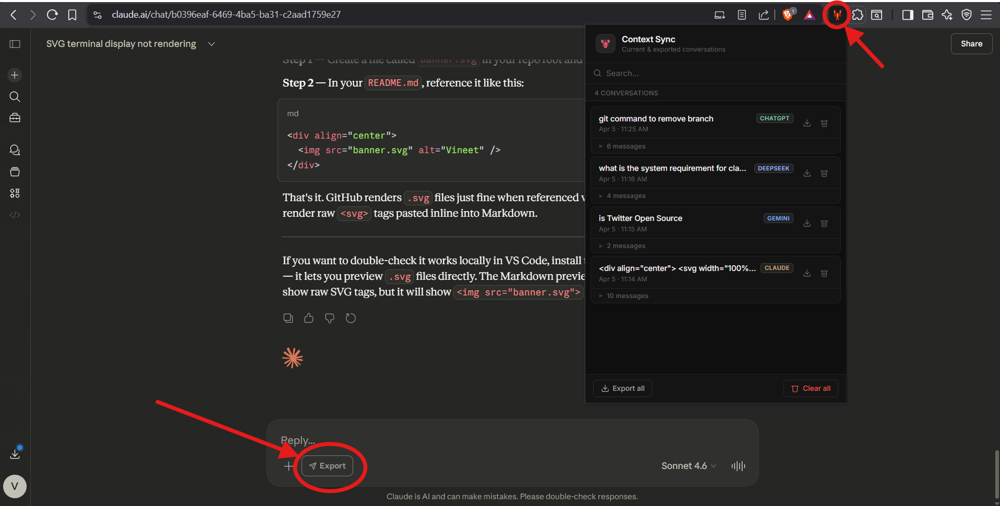
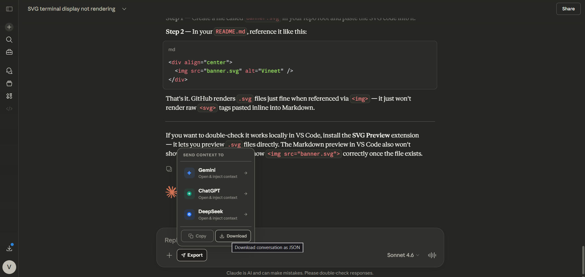

# 🦞 Context Sync


> **Never lose a conversation again.** Save, copy, download, and port your AI context across sessions, accounts, and any platform — Claude, ChatGPT, Gemini, or DeepSeek.

> _Previously known as **Claude Context Exporter** — now expanded to support all major AI platforms._

```
   ██████╗ ██████╗ ███╗   ██╗████████╗███████╗██╗  ██╗████████╗
  ██╔════╝██╔═══██╗████╗  ██║╚══██╔══╝██╔════╝╚██╗██╔╝╚══██╔══╝
  ██║     ██║   ██║██╔██╗ ██║   ██║   █████╗   ╚███╔╝    ██║   
  ██║     ██║   ██║██║╚██╗██║   ██║   ██╔══╝   ██╔██╗    ██║   
  ╚██████╗╚██████╔╝██║ ╚████║   ██║   ███████╗██╔╝ ██╗   ██║   
   ╚═════╝ ╚═════╝ ╚═╝  ╚═══╝   ╚═╝   ╚══════╝╚═╝  ╚═╝   ╚═╝  
   
  ███████╗██╗   ██╗███╗   ██╗ ██████╗
  ██╔════╝╚██╗ ██╔╝████╗  ██║██╔════╝
  ███████╗ ╚████╔╝ ██╔██╗ ██║██║     
  ╚════██║  ╚██╔╝  ██║╚██╗██║██║     
  ███████║   ██║   ██║ ╚████║╚██████╗
  ╚══════╝   ╚═╝   ╚═╝  ╚═══╝ ╚═════╝
```

---

## 📋 Table of Contents

1. [The Problem](#-the-problem)
2. [The Solution](#-the-solution)
3. [Features](#-features)
4. [Preview](#-preview)
5. [Architecture](#-architecture)
6. [Installation](#-installation)
7. [How to Use](#-how-to-use)
8. [Setting Up Gemini API for Compression](#-setting-up-gemini-api-for-compression)
9. [One-Click Cross-Platform Injection](#-one-click-cross-platform-injection)
10. [Exporting & Porting Context to Other AIs](#-exporting--porting-context-to-other-ais)
11. [Compression Pipeline](#-compression-pipeline)
12. [File Structure](#-file-structure)
13. [Roadmap](#-roadmap)
14. [Contributing](#-contributing)
15. [License](#-license)

---

## 😤 The Problem

You've spent **2 hours** on a deep technical session with an AI. You've:

- Debugged a gnarly auth flow
- Designed a full database schema together
- Made 12 architectural decisions
- Written 400 lines of code collaboratively

Then — **BAM.** You hit your usage limit. Or your account gets switched. Or you want to continue on ChatGPT because Claude is down.

**Everything is gone.** The context, the decisions, the nuance. You have to start from scratch and re-explain everything to a fresh AI that has no idea what you've been building.

This is the problem **Context Sync** was built to solve.

---

## 💡 The Solution

```
┌──────────────────────────────────────────────────────────────────────────────┐
│                                                                              │
│  Claude / ChatGPT / Gemini / DeepSeek  ──▶  🦞 Context Sync  ──▶  Capsule  │
│                                                                              │
│  Capsule  ──▶  One click  ──▶  Any AI (auto-injected & auto-submitted)      │
│                                                                              │
└──────────────────────────────────────────────────────────────────────────────┘
```

**Context Sync** is a Chrome extension that:

1. **Silently watches** your conversations on Claude, ChatGPT, Gemini, and DeepSeek using DOM observers
2. **Automatically saves** every message as you chat — no manual action needed
3. **Injects a native Export button** into every supported AI's toolbar — open a panel, pick a target AI, and your context is auto-injected and auto-submitted
4. **Lets you Copy** the conversation to clipboard as plain text in one click
5. **Lets you Download** the conversation as a portable JSON capsule in one click
6. **Shows all conversations in a unified popup** with colour-coded source badges and per-card export/delete controls

No cloud servers. No sign-up. Everything runs locally in your browser.

---

## ✨ Features

### 🖥️ Unified Popup
| Feature | Status |
|---|---|
| Auto-scrape active AI tab on popup open | ✅ Live |
| Conversations from all 4 AIs in one list | ✅ Live |
| Colour-coded source badges (Claude · ChatGPT · Gemini · DeepSeek) | ✅ Live |
| AI name labels on every message bubble | ✅ Live |
| Search across all saved conversations | ✅ Live |
| Per-card download as JSON | ✅ Live |
| Per-card delete with fade animation | ✅ Live |
| Export all conversations as one JSON | ✅ Live |
| Clear all conversations | ✅ Live |
| Conversation count in stats bar | ✅ Live |

### 💉 Injected Export Panel (on every AI page)
| Feature | Status |
|---|---|
| Native Export button injected into Claude toolbar | ✅ Live |
| Native Export button injected into ChatGPT toolbar | ✅ Live |
| Native Export button injected into Gemini toolbar | ✅ Live |
| Native Export button injected into DeepSeek toolbar | ✅ Live |
| Send context to another AI (opens tab + auto-injects + auto-submits) | ✅ Live |
| **Copy conversation to clipboard** (plain text) | ✅ Live |
| **Download conversation as JSON** directly from page | ✅ Live |
| Animated panel with smooth open/close | ✅ Live |
| MutationObserver keeps button alive after SPA re-renders | ✅ Live |

### 🧠 Scraping & Storage
| Feature | Status |
|---|---|
| Claude DOM scraper (MutationObserver + debounce) | ✅ Live |
| ChatGPT conversation scraper | ✅ Live |
| Gemini conversation scraper | ✅ Live |
| DeepSeek conversation scraper | ✅ Live |
| Unified `chrome.storage.local` across all AIs | ✅ Live |
| Up to 50 conversations stored locally | ✅ Live |
| SPA navigation detection (no page reload needed) | ✅ Live |
| Code blocks extracted and preserved verbatim | ✅ Live |
| AI-powered compression (Gemini 2.5 Flash, optional) | ✅ Optional |

---

## 🖼️ Preview

### Extension Popup — Unified conversation list with source badges



> The popup shows saved conversations from all four AI platforms in one place. Each card displays the conversation title, date, source AI badge (CLAUDE · CHATGPT · GEMINI · DEEPSEEK), a message count toggle, and per-card download/delete buttons.

---

### Injected Export Panel — Copy, Download, or send to another AI



> Clicking the **Export** button injected into the AI's toolbar opens this panel. Pick a destination AI to auto-inject the context, or use the **Copy** / **Download** buttons at the bottom to grab the conversation instantly.

---

## 🏗️ Architecture

```
┌───────────────────────────────────────────────────────────────────────┐
│                         Chrome Extension (MV3)                        │
│                                                                       │
│  ┌──────────────────┐    ┌──────────────────┐    ┌────────────────┐   │
│  │  Content Scripts  │    │  Background       │    │  Popup UI      │   │
│  │                  │    │  Service Worker   │    │                │   │
│  │  content.js      │───▶│  (orchestrator)   │◀───│  popup.html    │   │
│  │  (claude.ai)     │    │                  │    │  popup.js      │   │
│  │                  │    │  • Gemini API     │    │  popup.css     │   │
│  │  injectors/      │    │  • Message router │    │                │   │
│  │  ├ chatgpt.js    │    │  • scrapeActiveTab│    └────────────────┘   │
│  │  ├ gemini.js     │    └────────┬─────────┘                         │
│  │  └ deepseek.js   │             │                                   │
│  └──────────────────┘             ▼                                   │
│                          ┌─────────────────┐                          │
│                          │  Compression     │                          │
│                          │  Pipeline        │                          │
│                          │  (Gemini 2.5)    │                          │
│                          └────────┬────────┘                          │
│                                   │                                   │
│                    ┌──────────────┴──────────────┐                    │
│                    ▼                             ▼                    │
│          chrome.storage.local              (IndexedDB                 │
│          (unified index, 50 convos)         coming soon)              │
└───────────────────────────────────────────────────────────────────────┘
```

### How it works under the hood

**`content.js`** — Runs on every `claude.ai` page. Sets up a `MutationObserver` that watches the DOM for changes. When a new message appears, it triggers a debounced save (1.5 s delay to avoid saving mid-stream). Scrapes both user messages (`[data-testid="user-message"]`) and assistant responses (`.font-claude-response`), preserving code blocks. Injects the Export button with a panel offering send-to-AI, Copy, and Download.

**`injectors/chatgpt.js`** — Runs on `chatgpt.com`. Scrapes via `[data-message-author-role]`. Injects the Export button into ChatGPT's composer toolbar. On injection, fills the ProseMirror editor via `execCommand + insertText` and auto-clicks Send. Also exposes Copy and Download.

**`injectors/gemini.js`** — Runs on `gemini.google.com`. Scrapes from Angular's `user-query-content` and `model-response` elements. Injects the Export button near the toolbox drawer. Injects into the Quill editor by setting `innerHTML` and firing the full Angular event chain, then auto-submits. Triple-fires context check (0 ms / 1.5 s / 3 s) to survive Angular hydration delays. Exposes Copy and Download.

**`injectors/deepseek.js`** — Runs on `chat.deepseek.com`. Scrapes and saves DeepSeek conversations. Injects the Export button styled to match DeepSeek's native design. Handles context injection into the textarea and auto-submit. Exposes Copy and Download.

**`background.js`** — The service worker. Holds the Gemini API key securely (never in content scripts). Handles compression requests. Listens for `scrapeActiveTab` from the popup and routes `scrapeNow` to the correct content script.

**`popup.js / popup.html / popup.css`** — The extension popup. On open, auto-scrapes the active AI tab. Renders all saved conversations from all four platforms in one unified list, with colour-coded source badges, search, expand/collapse, per-card JSON export, and delete.

---

## 🚀 Installation

Since this extension is not yet on the Chrome Web Store, install it in **Developer Mode**:

### Step 1 — Download the extension files

```bash
git clone https://github.com/Vineetpandey0/context-sync.git
cd context-sync
```

### Step 2 — Open Chrome Extensions

Go to `chrome://extensions` in your browser.

### Step 3 — Enable Developer Mode

Toggle **Developer Mode** on (top right corner).

### Step 4 — Load the extension

Click **"Load unpacked"** and select the folder containing `manifest.json`.

### Step 5 — Verify installation

You should see the 🦞 lobster icon appear in your Chrome toolbar. If it's hidden, click the puzzle piece icon and pin it.

---

## 🛠️ How to Use

### Basic Usage (No API Key Required)

The extension works **out of the box** without any configuration. It saves your raw conversations without AI compression.

#### 1. Open any supported AI

Navigate to [claude.ai](https://claude.ai), [chatgpt.com](https://chatgpt.com), [gemini.google.com](https://gemini.google.com), or [chat.deepseek.com](https://chat.deepseek.com). The extension activates automatically.

#### 2. Chat normally

Just use the AI as you normally would. The extension silently captures every message in the background.

#### 3. Open the popup to view all conversations

Click the 🦞 icon in your toolbar. The popup auto-scrapes the active tab and immediately shows all saved conversations, sorted by most recent, with colour-coded source badges.

Each card shows:
- **Title** — inferred from your first message
- **Source badge** — CLAUDE / CHATGPT / GEMINI / DEEPSEEK
- **Date & time** saved
- **Message count** (tap to expand and read messages, with AI name on each bubble)
- **Download** — saves the conversation as a JSON capsule
- **Delete** — removes the conversation with a smooth fade

#### 4. Search conversations

Use the search bar to find any conversation by title or message content — across all platforms.

#### 5. Export all

Click **"Export all"** in the footer to download every saved conversation as a single JSON file.

---

## 🔑 Setting Up Gemini API for Compression

> **Compression is optional.** The extension saves full conversations without it.

### Why Gemini for compression?

**Gemini 2.5 Flash** is fast and has a generous free tier. The compression runs in the background service worker — your API key never touches a content script or any AI page.

### Step 1 — Get a free Gemini API key

1. Go to [Google AI Studio](https://aistudio.google.com/app/apikey)
2. Sign in with your Google account
3. Click **"Create API Key"** and copy it

### Step 2 — Add the key to background.js

```javascript
// Before:
const GEMINI_API_KEY = "";

// After:
const GEMINI_API_KEY = "AIzaSy...yourkey...";
```

### Step 3 — Reload the extension

Go to `chrome://extensions` → find Context Sync → click the **refresh** (↺) icon.

### What compression does

- **Code blocks** are extracted first and **never compressed** — preserved 100%
- **User messages** are compressed to preserve intent
- **Assistant messages** are compressed technically and losslessly
- **Short messages** (< 120 chars) are skipped — not worth a round-trip
- Processing is parallel (`Promise.all`) for speed

> **Privacy:** With a key active, message text is sent to Google's Gemini API. Leave the key blank to keep everything 100% local.

---

## 💉 One-Click Cross-Platform Injection

Every supported AI has a native **Export** button injected directly into its toolbar by the extension.

### How to use it

1. Open any conversation on Claude, ChatGPT, Gemini, or DeepSeek
2. Click the **Export** button in the toolbar
3. A panel opens:

```
┌─────────────────────────────┐
│  SEND CONTEXT TO             │
├─────────────────────────────┤
│  ◆  Gemini    Open & inject │
│  ●  ChatGPT   Open & inject │
│  ○  DeepSeek  Open & inject │
├─────────────────────────────┤
│ [ 📋 Copy ]  [ ⬇ Download ] │
└─────────────────────────────┘
```

4. **Click a target AI** — a new tab opens, the context is typed into the input, and the Send button is automatically clicked. The AI receives full context and responds immediately.
5. **Click Copy** — the conversation is formatted as plain text and written to your clipboard
6. **Click Download** — the conversation is saved as a `.json` capsule to your computer

### Injection reliability

| Platform | Injection method | Auto-submit |
|---|---|---|
| Claude | `chrome.storage.local` pending key + `execCommand` | ✅ Yes |
| ChatGPT | ProseMirror `execCommand + insertText` | ✅ Yes |
| Gemini | Quill `innerHTML` + Angular event chain (triple-fire) | ✅ Yes |
| DeepSeek | Native textarea setter + React synthetic events | ✅ Yes |

Each injector uses multiple fallback selectors and a MutationObserver to survive SPA re-renders.

### Cross-platform send matrix

| From ↓ / To → | Claude | ChatGPT | Gemini | DeepSeek |
|---|---|---|---|---|
| Claude | — | ✅ | ✅ | ✅ |
| ChatGPT | ✅ | — | ✅ | ✅ |
| Gemini | ✅ | ✅ | — | ✅ |
| DeepSeek | ✅ | ✅ | ✅ | — |

---

## 📤 Exporting & Porting Context to Other AIs

### The JSON Capsule Format

Every exported conversation follows this schema:

```json
{
  "id": "conv_1712345678_a3f2k",
  "title": "Building a React auth system with JWT...",
  "url": "https://claude.ai/chat/...",
  "savedAt": "2026-04-05T10:22:00.000Z",
  "source": "claude",
  "version": 1,
  "messages": [
    {
      "type": "user",
      "content": "How do I implement refresh token rotation?",
      "format": "text",
      "timestamp": "2026-04-05T10:00:00.000Z",
      "compressed": false
    },
    {
      "type": "assistant",
      "content": "Refresh token rotation works by...\n\n```javascript\nconst rotate = async (token) => { ... }\n```",
      "format": "text",
      "timestamp": "2026-04-05T10:00:00.000Z",
      "compressed": true
    }
  ]
}
```

The `source` field (`claude`, `chatgpt`, `gemini`, `deepseek`) drives the badge colour in the popup.

### Manual injection (works with any AI)

For AIs not supported natively, paste this into a new chat:

```
Here is the full context of a previous conversation. Please read it carefully 
and continue helping me as if you were already familiar with everything discussed.

[paste the JSON here]

Continuing from where we left off: [your next question]
```

### Context window compatibility

| AI | Context Window | Works with export? |
|---|---|---|
| Claude 3.5 Sonnet | 200k tokens | ✅ Excellent |
| GPT-4o | 128k tokens | ✅ Great |
| Gemini 1.5 Pro | 1M tokens | ✅ Best for large exports |
| DeepSeek V3 | 128k tokens | ✅ Good |
| Mistral Large | 128k tokens | ✅ Good |
| Llama 3 (local) | 8k–128k tokens | ⚠️ Use compression first |

---

## ⚙️ Compression Pipeline

> **Status:** Actively improved. Current pipeline uses Gemini 2.5 Flash. A fully local pipeline is in development.

```
Raw Conversation
      │
      ▼
1. CODE BLOCK EXTRACTION
   - All ``` blocks extracted with placeholders
   - Code is NEVER sent to any model — preserved verbatim

      │
      ▼
2. MESSAGE FILTERING
   - Keep last 5 user messages
   - Keep last 5 assistant messages
   - Maintain original interleaved order

      │
      ▼
3. PER-MESSAGE COMPRESSION (Gemini 2.5 Flash, parallel)
   - Skip messages < 120 characters
   - User messages: preserve intent, remove filler
   - Assistant: technical lossless compression

      │
      ▼
4. CODE BLOCK RESTORATION
   - Placeholders replaced with original code
   - Stored in chrome.storage.local
```

### Planned improvements

- [ ] TF-IDF sentence scoring for assistant explanations
- [ ] Type tagging (`question`, `code`, `explanation`, `decision`)
- [ ] Rolling window manager (10 sessions, tiered compression)
- [ ] Local NLP compression — zero API calls, zero data leaving your machine
- [ ] Token counter — real-time estimate vs. target AI's context window

---

## 📁 File Structure

```
Context-Sync/
├── manifest.json               ← MV3 config, host permissions for all 4 AIs
├── background.js               ← Service worker: Gemini API, routing, scrapeActiveTab
├── content.js                  ← Claude scraper + Export button + Copy/Download
├── injectors/
│   ├── chatgpt.js              ← ChatGPT scraper + Export panel + Copy/Download
│   ├── gemini.js               ← Gemini scraper + Export panel + Copy/Download
│   └── deepseek.js             ← DeepSeek scraper + Export panel + Copy/Download
├── popup/
│   ├── popup.html              ← Popup markup
│   ├── popup.js                ← Unified list, source badges, search, export, delete
│   └── popup.css               ← Dark grayscale theme, Inter font
├── assets/
│   ├── Preview.png             ← Popup screenshot
│   └── InjectedUI.png          ← Injected Export panel screenshot
├── icons/
│   ├── icon16.png
│   ├── icon48.png
│   └── icon128.png
└── README.md
```

### Key constants

| File | Constant | Default | Description |
|---|---|---|---|
| `content.js` | `MAX_CONVERSATIONS` | `50` | Max conversations stored locally |
| `content.js` | `DEBOUNCE_MS` | `1500` | ms to wait before saving after DOM change |
| `background.js` | `GEMINI_API_KEY` | `""` | Your Gemini API key (leave blank to skip compression) |

### Host permissions

| Host | Purpose |
|---|---|
| `https://claude.ai/*` | Scraping + Export button injection |
| `https://generativelanguage.googleapis.com/*` | Gemini compression API |
| `https://gemini.google.com/*` | Scraping + Export button injection |
| `https://chatgpt.com/*` | Scraping + Export button injection |
| `https://chat.deepseek.com/*` | Scraping + Export button injection |

---

## 🗺️ Roadmap

### v1.2.0 — Coming Soon
- [ ] Storage size indicator in popup stats bar
- [ ] Visual compression ratio stats (e.g. "48k → 6k tokens, 87% reduction")
- [ ] Fallback selector config exposed in settings (for when AI sites update their DOM)
- [ ] Session fingerprinting to detect and deduplicate identical sessions

### v1.3.0
- [ ] IndexedDB upgrade for 100+ conversation projects
- [ ] Tag-based organisation (group conversations by project across AIs)
- [ ] Per-conversation compression toggle in the popup

### v1.4.0 — 🔧 Work in Progress
- [ ] **Local NLP compression** — browser-native pipeline, zero API calls, zero data leaving your machine
- [ ] **Downloads manager** — view, rename, re-download exported JSON capsules from inside the popup
- [ ] **Rolling 10-session context window** — automatic tiered compression for older sessions

### v2.0.0 — Future Vision
- [ ] Universal "Context Capsule" standard readable by all major LLMs
- [ ] Cross-device sync via optional encrypted cloud backup
- [ ] Firefox support (MV2/MV3 port)
- [ ] Context analytics dashboard

---

## 🤝 Contributing

Pull requests are welcome! Here's how to get started:

1. Fork the repository
2. Create a feature branch: `git checkout -b feature/my-feature`
3. Make your changes
4. Test by loading the unpacked extension in Chrome
5. Commit: `git commit -m 'Add: my feature'`
6. Push: `git push origin feature/my-feature`
7. Open a Pull Request

### Areas we especially need help with

- **DOM selector resilience** — all four AI sites update their DOM; hardening selectors and adding fallbacks is ongoing
- **Compression heuristics** — better sentence scoring for explanation messages
- **Firefox port** — MV3 APIs; a Firefox-compatible port would help many users
- **Local NLP** — a browser-native compression pipeline with zero external API calls
- **New platforms** — Perplexity, Mistral, Grok, or any major AI chat interface

---

## 📄 License

MIT License — see [LICENSE](./LICENSE) for details.

---

## 💬 FAQ

**Q: Does this send my conversations to any server?**  
A: Only if you add a Gemini API key for compression. Without it, everything stays 100% local in `chrome.storage.local`. The cross-platform injection pipeline uses local storage as a relay — no external calls.

**Q: The Export button doesn't appear in the toolbar.**  
A: The injectors retry up to 30 times (every 500 ms) and watch via MutationObserver. Try refreshing the page. If it consistently fails, the host site may have updated its DOM — please open an issue.

**Q: Context was injected but the AI didn't auto-submit.**  
A: Injectors wait up to 4 s for the Send button to become enabled. If it times out, a banner appears asking you to press Send manually.

**Q: What happens when an AI site changes its DOM?**  
A: Each injector has multiple fallback selectors. We'll push fixes as sites update. If you notice a break, open an issue with the platform name.

**Q: How much storage does this use?**  
A: Chrome's `chrome.storage.local` allows 5 MB by default. 50 conversations from all four AIs combined sit comfortably under 2 MB.

**Q: Can I use this with Claude's Projects feature?**  
A: Yes. The extension detects any conversation URL pattern including project UUIDs.

**Q: I want to send context to Mistral / Perplexity — can I?**  
A: Not natively yet, but use the **Copy** button in the Export panel and paste into any AI with a simple prompt like *"Here's context from a previous conversation: [paste]. Continue from here."*

---

<div align="center">

Built with 🦞 and frustration by developers who kept hitting AI context limits.

**Stop losing context. Start syncing it.**

</div>
